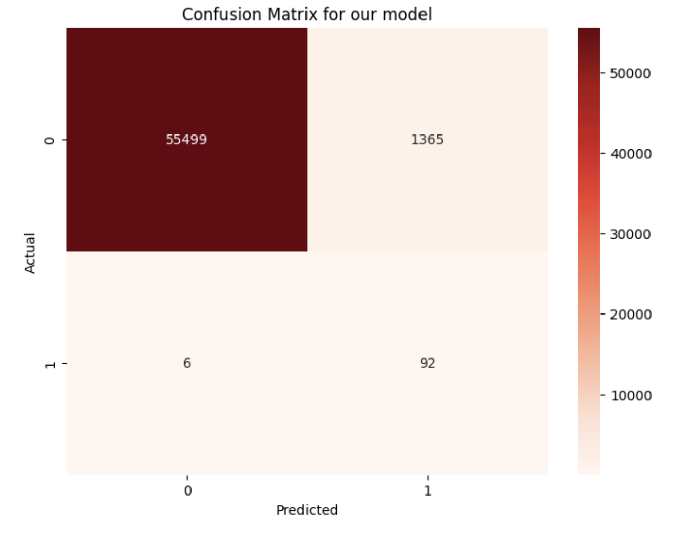
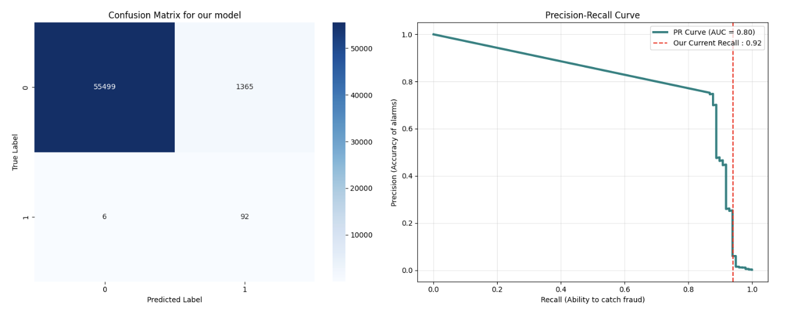

# 🛡️ Fraud Guard: A Deep Dive into Neural Networks and Statistical Risk

### 🚀 The Goal: Can we teach a computer to spot a lie?
The goal of this project was to take a massive list of credit card transactions and teach a computer to identify which ones are "fraud" and which ones are "real." As a freshman, I wanted to go beyond just using a tool—I wanted to understand the **Math** and the **Logic** that makes it work.

---

### 🛠️ Step 1: Handling the "Ghost" Data (SMOTE)
In the real world, fraud is rare. If you have 100,000 transactions, maybe only 100 are fraud. If you train a computer on that, it will just learn to say "Not Fraud" every time and be 99.9% accurate, but it actually learned nothing. Training the model on just fraud data would oversample it, but non fraud data would undersample the model and make it less accurate when exposed to another dataset that includes real credit card transactions.

To fix this, I used a technique called **SMOTE (Synthetic Minority Over-sampling Technique)**. 

Imagine you have two dots on a graph representing fraud. SMOTE doesn't just copy those dots. Instead:
1. It looks at a fraud transaction and finds its **5 closest neighbors**.
2. It draws a literal line between them.
3. It plots new, **"synthetic" points** along that line.

By doing this, we created a 50/50 balance. This type of sampling technique is useful because we cannot just train our model on only fraud data or only on non-fraud data since they are oversampling and undersampling respectively. Now the model has enough "Fraud examples" to actually learn the patterns instead of just guessing the majority. Using this, we were able to create 455,000 instances of credit card transactions, half of them simulating real transactions, and half of them simulating fraud transactions, hence giving the model enough data to train on.

---

### 🧠 Step 2: How the "Brain" Works (The MLP Classifier)
I used a **Multi-Layer Perceptron (MLP)**. This is a type of Neural Network. To understand it, you have to understand Linear Algebra.

**The Linear Combination Math:**
Our dataset has 30 "features" (like Time, Amount, and other technical indicators). 
* Imagine we have **32 neurons** in our first layer. 
* Each of those 32 neurons is looking at **all 30 features at once**. 
* Every neuron calculates a **Linear Combination**: it multiplies each feature by a specific weight and adds a "bias" (a constant number). 
* *In Linear Algebra terms:* Each neuron can be expressed as a linear combination of these 30 features added by a constant.

**The ReLU Filter:**
After that math is done, we run a **ReLU (Rectified Linear Unit)** function. This basically says: if we get a negative value, drop it and only keep the positives. We use `max(0, x)` to ensure the model only passes on "activated" signals to the next layer.

**The "Book Summary" Analogy (Why 3 Layers?):**
One might ask: why not have 100 layers? Think of it like this:
* Suppose you have a **book with 32 pages** (our first layer).
* You summarize that book into **16 paragraphs** (the next layer).
* Then you summarize those into **8 phrases** (the final layer).
* Finally, you use a **Sigmoid function** to transform those 8 phrases into a single value between 0 and 1 to calculate the probability of fraud.

If you have **too many layers**, it’s like trying to summarize that book 500 times. Eventually, you "obscure" the data. The original meaning is lost, and the model performs worse. For this project, three layers were the perfect "sweet spot."

---

### 📊 Final Stats & Visual Performance
Before hyperparameter tuning, we had many false positives and a low precision score. However, after including **Alpha processing**, **Adam optimization**, and adjusting the **batch score**, we significantly improved the results.

#### Confusion Matrix
The matrix below shows that we caught **92 out of 98** actual fraud cases. While we had some false alarms (1,365), in the world of fraud, catching the thief is often prioritized over the occasional false positive.

#### Precision-Recall Curve
This graph shows the trade-off between the accuracy of our alarms (Precision) and our ability to catch all fraud (Recall). Our current recall sits at a strong **0.92**, meaning we have a 92% "Catch Rate."

---

### 🚨 Step 3: Solving the "Astronomical" Problem (The 2.2 Sigma Rule)
While hosting the app on **Streamlit**, I discovered a critical edge case: when transaction amounts reached **unfathomable numbers**—like a billion dollars—the neural network sometimes reported them as "Not Fraud." 

**The Mathematical Gap:**
Neural Networks learn patterns based on the data they see during training. If the model only saw transactions up to $25,000, it doesn't have the context to understand a $1,000,000,000 transaction. These massive numbers can produce unexpected mathematical results inside the neurons.

**The Solution: Statistical Probability & The Empirical Rule**
To fix this, I implemented a **2.2 Standard Deviation (2.2σ) Rule**. To understand why I chose 2.2, we look at a Standard Normal Distribution:
* **±1 Standard Deviation:** Covers about **68%** of all data.
* **±2 Standard Deviations:** Covers about **95%** of all data.
* **±2.2 Standard Deviations:** Covers approximately **97-98%** of the distribution.

By setting the threshold at **2.2σ**, I am essentially saying: *"This transaction is in the extreme top 2% of all recorded history."* A transaction that is statistically that **uncanny** is a clear indicator of a possible instance of fraud. This **Statistical Safety Rail** ensures that even if the AI gets confused by the scale, our logic remains unshakeable.

---

### 🧘 Final Reflection
As a freshman, this project taught me that **Machine Learning is 20% code and 80% logic.** You can't just throw data at a "brain" and hope it works. You have to understand the linear algebra behind the neurons, handle the class imbalance with SMOTE, and use statistics to build safety rails for cases where the AI might fail.
